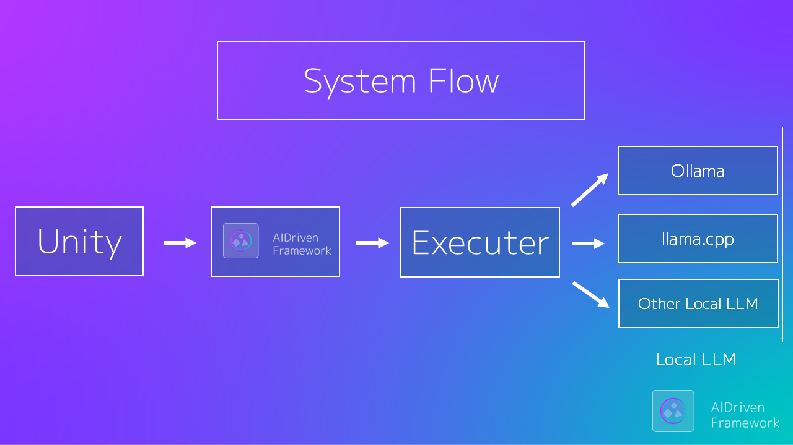

# AIDrivenFramework 🚀  
**Unity × ローカルLLM セーフフレームワーク**

Unity にローカル LLM を安全に統合するための  
セットアップ & 実行管理フレームワークです。


[](LICENSE)  
[](https://discord.gg/dfzwqCHSW2)

🎥 [紹介動画](https://www.youtube.com/watch?v=_Foj7tXq_Ss)  
[English version Readme is here](README.md)

---
## 🎞 Demo

### モデルセットアップデモ


---
## 🛠 システムアーキテクチャ



AIDrivenFrameworkは、柔軟なExecutorアーキテクチャを通じてUnityで作られたゲームとローカルLLM環境を接続します。

---
## ✨ 主な機能

- 🎯 **Unity向け設計**: Play Mode・ビルド対応でゲームにスムーズに統合可能
- 🧠 **シンプル統合**: 三行のコードでローカルLLMをゲームに組み込み可能
- 💬 **ストリーミング生成対応**: 生成テキストを逐次受信・表示。チャットやインタラクティブな演出に活用可能。
- 🔁 **自動リトライ機構**: 生成に失敗した場合も最大3回まで自動で再試行
- 🛠 **統合セットアップウィザード**: Ollama不要・GUIで簡単に導入
- 🚀 **自動セットアップ起動**: AISetupが存在する場合、初回実行時に自動でセットアップを開始
- 🔒 **安全設計**: モデル準備完了前の生成を防止
- ⚡ **自動初期化**: Play開始時にLLM環境を自動準備
- 🧩 **モジュラー実行基盤**: CLI・HTTP・カスタムを柔軟に切り替え
- 🧼 **クリーン＆安定実行**: CLIノイズ完全除去で純粋な応答だけ返却

Unity 側は、最小限かつクリーンな API のみを扱います。

---

## ⚡ クイックスタート

### 1️⃣ インストール

OpenUPMからのインストールを推奨します：

```bash
openupm add com.hatomaru.ai.framework
```

または、Unity Package Managerから次のGit URLを追加します：

```
https://github.com/hatomaru/AIDrivenFramework.git?path=src/AIDrivenFramework
```

> [!IMPORTANT]
> Git URLから導入する場合は、後述する必須依存パッケージを先にプロジェクトへ追加してください。依存パッケージは本リポジトリに同梱されていません。

---

### 2️⃣ ローカルLLMの準備 (Ollamaを使用しない場合)

以下は別途ダウンロードしてください：

- `llama.cpp`
- `.gguf` モデルファイル

（本リポジトリには含まれていません）

> [!TIP]
> llama.cpp のビルド済みバイナリ：  
> https://github.com/ggerganov/llama.cpp/releases  
>  
> 推奨モデル例：  
> https://huggingface.co/elyza/Llama-3-ELYZA-JP-8B-GGUF  

---

### 3️⃣ 初期化

環境が未設定の場合：

- セットアップシーンが自動で開きます  
- オプションの **AISetup** コンポーネントが必要です  

> [!TIP]
> `IsPrepared()` はオプションの `GenAI` インスタンスを受け取ります。
>
> 既存のインスタンスを渡すことで、ヘルスチェック後にLLMプロセスが終了するのを防ぎ、
> モデルの二重読み込みを回避し、起動パフォーマンスを向上させます。
>

---

### 4️⃣ 生成

```csharp
using AIDrivenFW.API;

var genAI = new GenAI();
var result = await genAI.Generate("Hello AI");
Debug.Log(result);
```

これで準備完了です 🎉

---

## 対応LLMランタイム

- Ollama（HTTP）
- llama.cpp CLI（デフォルトExecutor）
- llama.cpp server（HTTP）

---

## 🧙 セットアップウィザード（AISetupコンポーネント）

オプションの **AISetup** パッケージは、  
初心者向けのセットアップウィザードを提供します。

- 未設定状態の自動検出
- `llama.cpp` 実行ファイル選択GUI
- `.gguf` モデルファイル選択GUI

> [!TIP]
> オプションのサンプルシーンを導入できます
>  
> メニューから手動起動：  
> `Tools > AIDrivenFW > Optional Packages`

セットアップウィンドウからインストール可能（オプション依存）。

> 初回導入を大幅に簡単にします。特に初心者におすすめです。

---

## 🎮 サンプルゲーム

現在、オプションの **Example** パッケージに2本のサンプルゲームを同梱しています。

`Tools > AIDrivenFW > Optional Packages`を開き、**Example Scene**と**AISetup**の両方を選択して**Install Selected**を押すと導入できます。現在のサンプルはAISetupのコンポーネントを参照しているため、Example Sceneだけを導入するとコンパイルできません。

| Sample | 名前 | 概要 | サンプルが使用するExecutor |
|---|---|---|---|
| 1 | AI NPC Roleplay Chat | NPCの人格と会話履歴を保ちながら、AI NPCと自由に会話するサンプル | `OllamaHTTPExecutor` |
| 2 | Guess the Topic | 質問を重ね、ゲームが選んだお題を当てるサンプル | `LlamaHTTPExecutor` |

**企画中・現時点では未同梱：** Dialogue Battle、AI Story Generator

---

## 🎯 主要公開API（V1）

```csharp
using AIDrivenFW.API;
using AIDrivenFW.Config;
using UnityEngine;

public sealed class AIExample : MonoBehaviour
{
    private async void Start()
    {
        var genAI = new GenAI();
        var config = ScriptableObject.CreateInstance<GenAIConfig>();
        config.sysPrompt = "親切なNPCとして応答してください。";

        var isPrepared = await AIDrivenInitializer.Initialize(defaultGenAI: genAI);
        if (!isPrepared) return;

        var result = await genAI.Generate("こんにちは、AI！", config);
        Debug.Log(result);
    }
}
```

上記が推奨されるエントリーポイントです。上級者向けのExecutor実装も公開されていますが、今後の開発で変更される可能性があります。

---

## 🧠 なぜAIDrivenFrameworkなのか？

単なるラッパーではありません。

- モデル未ロード状態での生成を防止  
- プロセス未起動状態を防止  
- APIレベルで安全性を保証  
- Executor差し替えに対応  

**長期的な Unity × AI アーキテクチャ設計** を想定しています。

---

## 🔁 Executor差し替え（上級者向け）

実行レイヤーを差し替え可能：

```csharp
var genAI = new GenAI();
genAI.SetExecutor(customExecutor);
```

デフォルト実装：

```
LlamaCliExecutor
```

HTTP通信や独自プロセス管理も実装可能です。

---

## 🔧 必須依存パッケージ

- [UniTask](https://github.com/Cysharp/UniTask)（非同期処理）
- [LitMotion](https://github.com/AnnulusGames/LitMotion/blob/main/README_JA.md)（UI / アニメーション制御）

---

## 🖥 動作環境

### 最低動作環境
- Unity 6（6000.0）以上（現行のpackage manifestに準拠）
- Windows 10 / 11（64bit）または macOS
- RAM：8GB以上

> 以前のUnityバージョンは、現行のpackage manifestに対する動作検証を行っていません。

### 推奨環境
- RAM：16GB以上
- GPU VRAM：8GB以上（使用するAIモデルに依存）

---

## 💬 コミュニティ

質問・実験共有・Unity × ローカルLLM議論はこちら：

👉 CommunityGuild  
https://discord.gg/dfzwqCHSW2

---

## ⚖ ライセンス

- フレームワーク本体：MIT License  
- モデル・LLM実行環境：含まれません  
- 各公式配布元のライセンスに従ってください  

---

## 🎮 想定ユーザー

- UnityでLLMを使いたい開発者  
- 実行安全性を重視する開発者  
- AI × ゲーム表現を試したい方  
- 実験的OSSに興味がある方  

---

## ✍ 作者より

AIDrivenFramework は  
**「ローカルLLM導入の安全な入り口」** を作るために設計されました。

Issue・PR・改善提案は大歓迎です。
